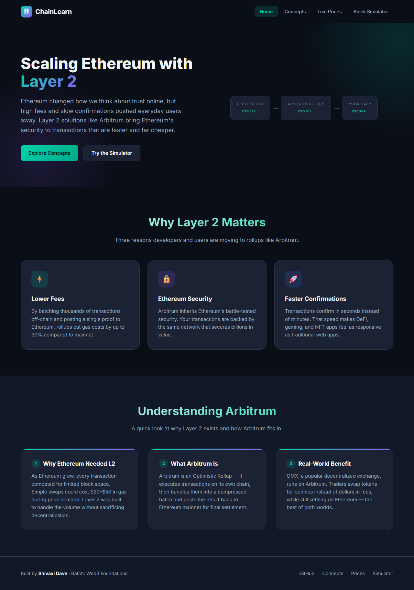
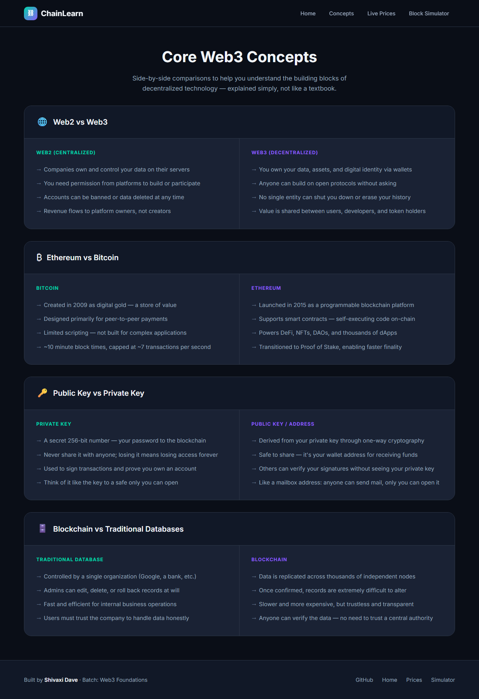
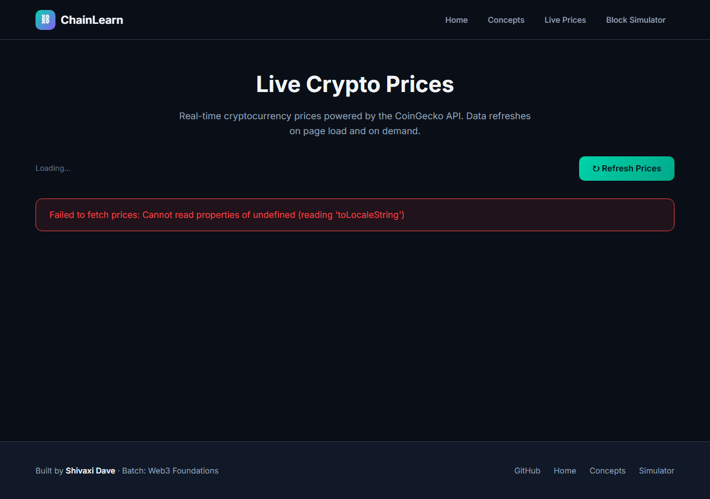
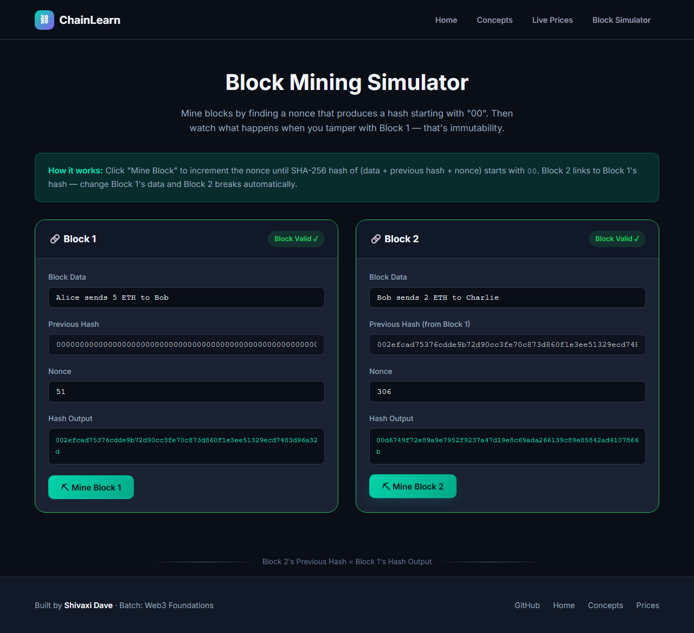

<<<<<<< HEAD
# ChainLearn — Web3 Educational Website

A four-page educational website exploring core Web3 concepts through interactive modules and live data. Built with plain HTML, CSS, and JavaScript — no build step required.

**Theme:** Arbitrum & Layer 2 scaling on Ethereum

## Pages

| Page | File | Description |
|------|------|-------------|
| **Home / Landing** | `index.html` | Introduces Layer 2 scaling and Arbitrum with hero, features, and an explainer on why Ethereum needed L2 |
| **Concepts** | `concepts.html` | Visual side-by-side comparison cards covering Web2 vs Web3, Ethereum vs Bitcoin, Public vs Private Keys, and Blockchain vs Traditional Databases |
| **Live Prices** | `prices.html` | Real-time crypto price dashboard fetching ETH, BTC, SOL, MATIC, and ARB from the [CoinGecko API](https://www.coingecko.com/en/api) |
| **Block Simulator** | `simulator.html` | Interactive SHA-256 mining simulator demonstrating nonces, proof-of-work, and chain immutability |

## Project Structure

```
web3/
├── index.html          # Home / Landing page
├── concepts.html       # Web3 concept comparisons
├── prices.html         # Live crypto price dashboard
├── simulator.html      # Block mining simulator
├── css/
│   └── styles.css      # Shared styles (dark theme, responsive)
├── js/
│   ├── nav.js          # Shared navigation & mobile menu
│   ├── prices.js       # CoinGecko API integration
│   └── simulator.js    # Block mining & chain validation logic
├── screenshots/        # Page screenshots for submission
└── README.md
```

## How to Run Locally

No installation or dependencies needed.

**Option 1 — Open directly**

Double-click `index.html` in your file explorer, or open it in any modern browser.

**Option 2 — Local dev server (recommended for Live Prices)**

The CoinGecko API may block requests from `file://` URLs. Use a simple local server:

```bash
# Python 3
python -m http.server 8080

# Node.js (if npx is available)
npx serve .

# VS Code Live Server extension
# Right-click index.html → "Open with Live Server"
```

Then visit `http://localhost:8080` in your browser.

## Features

- **Shared navigation** across all four pages with active page highlighting
- **Responsive design** — mobile-friendly layout with collapsible nav menu
- **Live price data** — green/red arrows for 24h price change, manual refresh button
- **Block simulator** — mines until hash starts with `00`, links Block 2 to Block 1, breaks chain when Block 1 data is tampered

## Author

- **Name:** Shivaxi Dave
- **Batch:** Web3 Foundations
- **GitHub:** [github.com/shivaxidave](https://github.com/shivaxidave)

## Known Issues & Future Improvements

- CoinGecko free tier rate-limits requests (~10–30 calls/min). Rapid refreshes may temporarily fail.
- Opening via `file://` can block API fetch due to CORS — use a local server for the prices page.
- Block simulator difficulty is fixed at two leading zeros; a difficulty slider would be a nice addition.
- Could add a coin search bar on the prices page using CoinGecko's search endpoint.
- Could add sparkline charts for price trends using historical data.

## Screenshots

| Page | Preview |
|------|---------|
| Home / Landing |  |
| Concepts |  |
| Live Prices |  |
| Block Simulator |  |

## Tech Stack

- HTML5
- CSS3 (custom properties, Grid, Flexbox)
- Vanilla JavaScript (Web Crypto API for SHA-256)
- [CoinGecko Public API](https://api.coingecko.com/api/v3/simple/price) — no API key required
- [Google Fonts — Inter](https://fonts.google.com/specimen/Inter)
=======
# ChainLearn
>>>>>>> 219c9b6852ba409b814501ea7bee1a21a53d93cf
